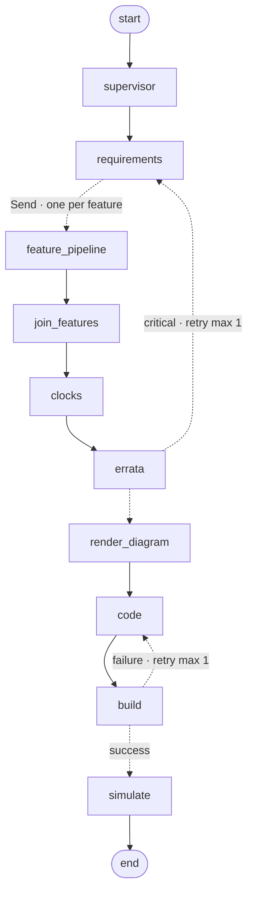

# Silo Labs

AI firmware generator. Describe what you want in natural
language; a multi-agent LangGraph pipeline emits pin assignments, clock configuration,
register writes, wiring, C code, and a Wokwi simulation — live, streamed over SSE.

## Canonical demo

> Read a BME280 over I2C and display the readings on an SSD1306 OLED.

## Architecture

Multi-agent LangGraph pipeline. The diagram below is generated from
`pipeline.get_graph().draw_mermaid()` — it is the actual compiled graph, not a
hand-drawn approximation. A PNG fallback ([`docs/architecture.png`](docs/architecture.png))
is committed for renderers that don't support Mermaid.



Solid arrows are unconditional edges. Dashed arrows are conditional edges
(LangGraph routes through them based on state). The two retry edges are
budget-bound — `code_retries` and `errata_retries` cap each at one attempt.

### Nodes

| Node | Role | Model | Notes |
|---|---|---|---|
| `supervisor` | Decompose prompt into N parallel features | Sonnet 4.6 | Emits `RunPlan` (FeatureSpec list + rationale) |
| `requirements` | Parse to one canonical `Requirements` record | Sonnet 4.6 | Peripheral, device, intent, optional address/baud |
| `feature_pipeline` | One feature's pinout + peripheral config + wiring | Sonnet 4.6 | Runs in parallel — one branch per `FeatureSpec`, dispatched via `Send` |
| `join_features` | Merge per-feature outputs into top-level state | — | Custom dict reducer makes the parallel writes commutative |
| `clocks` | Configure XOSC / PLL / CLK_SYS / CLK_PERI | Sonnet 4.6 | One global pass after join |
| `errata` | RP2040 errata cross-reference | Haiku 4.5 | Critical workarounds loop back to `requirements` |
| `render_diagram` | Build the merged Wokwi `diagram.json` | — | Deterministic render of all per-feature wires |
| `code` | Generate multi-file project (drivers, headers, CMake, main.c) | Sonnet 4.6 | `MultiFileProject` schema, 12k token budget, build-stderr retry hint |
| `build` | cmake + ninja + arm-none-eabi-gcc | — | Failure feeds tail of stderr back into `code` |
| `simulate` | `wokwi-cli` (live) or fixture replay | — | Streams serial via SSE; finalizes metrics |

### LangGraph features actually used

- Parallel fan-out via the `Send` API (one branch per feature)
- Custom reducer on `feature_outputs` so concurrent Send branches merge instead of clobber
- Conditional edges with bounded retries: `build → code` on failure, `errata → requirements` on critical workaround
- `RetryPolicy(max_attempts=2, backoff=2.0)` on every LLM-bearing node
- `MemorySaver` checkpointer keyed by `session_id`; resumable via `POST /api/sessions/{id}/resume` (one-line swap to `SqliteSaver` for production)
- `@instrumented` decorator captures per-node tokens / duration / cost; `parallel_speedup` derived from `sum(feature wall-clocks) / max(feature wall-clock)`

### MCU profile abstraction

`DesignState.target_mcu` selects an `McuProfile` (registry in `app.mcu`).
RP2040 is the one concrete profile today; adding ESP32 / STM32 means
implementing the protocol (`svd_summary`, `pinout_options`, `build_firmware`,
`run_simulation`, `code_composer_system_prompt`, `wokwi_part_for`) and calling
`register_profile`. No pipeline edits required.

### Vendor-doc research

Agents bind LangChain `@tool` wrappers (`fetch_part_doc`, `fetch_url`) backed
by an httpx fetcher restricted to a curated allow-list of vendor hosts
(`docs.wokwi.com`, `raspberrypi.com`, Adafruit, Bosch, TI, ST, NXP,
Microchip, ARM). Results are cached on disk under
`~/.cache/silo-labs/research/`.

### Stack

- **Backend** (`backend/`): FastAPI · LangGraph 1.1 · Claude Sonnet 4.6 / Haiku 4.5 · Pydantic v2. Knowledge graph from the RP2040 CMSIS-SVD. `arm-none-eabi-gcc` + pico-sdk for builds. `wokwi-cli` for live simulation.
- **Frontend** (`frontend/`): Next.js 15 · React 19 · Tailwind 4 · Zustand store driven by typed SSE events. Monaco, xterm.js, @xyflow/react, Three.js, Framer Motion.

## Run locally

```bash
docker compose up
# backend:  http://localhost:8000
# frontend: http://localhost:3000
```

Environment (`backend/.env`):

```
ANTHROPIC_API_KEY=...
WOKWI_CLI_TOKEN=...   # optional; fixture used if absent
```

## Tests

```bash
cd backend && pytest tests/
cd frontend && npx tsc --noEmit
```

## Deploy

- Backend: `modal deploy backend/modal_app.py`
- Frontend: `vercel --prod` from `frontend/`
